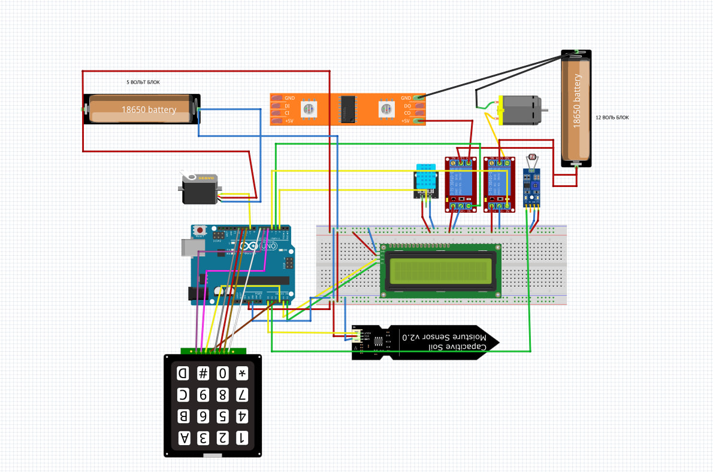

Умная автоматизированная мини‑теплица на базе Arduino, управляемая с помощью 4×4 клавиатуры и отображающая данные на LCD-дисплее. Реализует режимы автоматического и ручного управления вентиляцией (серво­привод), освещением и поливом.

---

## 📦 Состав репозитория

- `teplitsa.ino` — основной скетч для Arduino  
- `shem.jpg` — схема подключения датчиков и исполнительных устройств  

---

## ⚙️ Особенности

- **Три режима работы**  
  - MAIN – отображение текущих показаний  
  - AUTO – автоматическое управление по пороговым значениям  
  - MANUAL – ручное включение/выключение всех устройств  
- **Датчики и исполнительные устройства**  
  - Датчик температуры и влажности DHT11  
  - Фоторезистор (LDR) для измерения освещённости  
  - Датчик влажности почвы  
  - Серво­привод для открывания/закрывания люка  
  - Электронасос для полива  
  - Лампа подсветки  
- **Управление через 4×4 клавиатуру** и вывод текущих значений на LCD по интерфейсу I²C

---

## 🛠 Требования

- Плата Arduino Uno (или совместимая)  
- Модуль DHT11 (датчик температуры/влажности)  
- Фоторезистор + делитель напряжения  
- Датчик влажности почвы  
- Серво­привод (5V)  
- Электронасос 5V  
- Реле/транзисторы для управления лампой и насосом  
- LCD‑дисплей 16×2 с I²C‑модулем (адрес 0x27)  
- Клавиатура 4×4  
- Провода, макетная плата и источник питания

---

## 🔌 Схема подключения



1. DHT11 — цифровой пин D2  
2. LDR — аналоговый вход A0 (через делитель)  
3. Датчик влажности почвы — A1  
4. Насос — пин D3 (через реле/транзистор)  
5. Лампа — пин D4 (через реле/транзистор)  
6. Серво — пин D9  
7. LCD I²C — SDA A4, SCL A5  
8. Клавиатура: ROWS = A2, A3, D5, D6; COLS = D7, D10, D11, D12  

---

## 🚀 Сборка и загрузка

1. Склонируйте репозиторий:
   ```bash
   git clone https://github.com/yourusername/SmartGreenhouse.git
````

2. Откройте `teplitsa.ino` в Arduino IDE.
3. Выберите плату и порт.
4. Загрузите скетч на плату.

---

## 🎛 Управление

### Выбор режима

* Нажать **A** – перейти в AUTO
* Нажать **B** – перейти в MANUAL
* Нажать **C** – вернуться в MAIN

### Ручное управление (MANUAL)

* `1` – включить/выключить насос
* `2` – включить/выключить лампу
* `3` – открыть/закрыть серво­люк

### Пороговые значения (AUTO)

* Температура: **26 °C**
* Влажность почвы: **500** (0–1023)
* Освещённость: **600** (0–1023)

> При превышении порогов AUTO‑режим автоматически включает/выключает насос, лампу и открывает/закрывает люк.

---

## 📈 Отображение данных

В режиме **MAIN** (и во всех режимах) на LCD выводятся:

```
Mode: MAIN/AUTO/MANUAL
T:xx H:yy L:zz
```

* `T` – температура (°C)
* `H` – показания влажности почвы
* `L` – уровень освещённости

---


